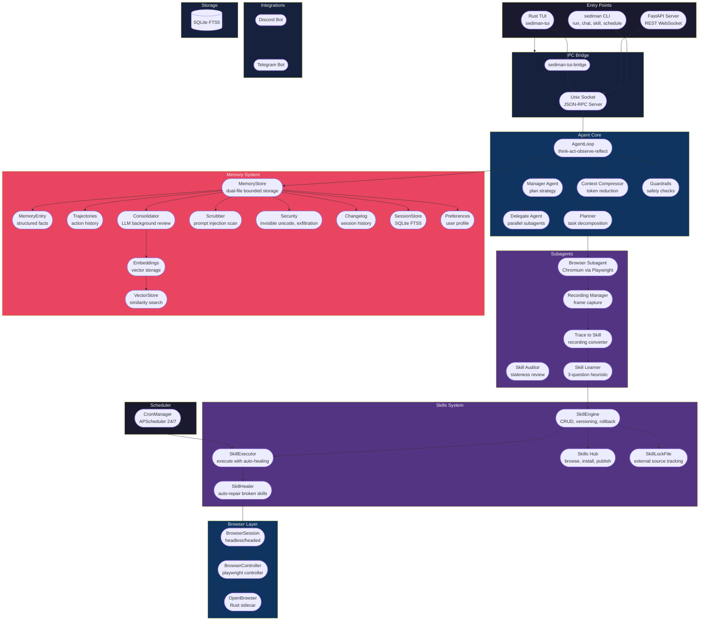

<div align="center">

# Sediman

**Your AI browser employee that works while you sleep.**

Teach it once. It repeats forever. 24/7.

[](LICENSE)
[]()

</div>

---


---

## Stop doing the same tasks. Every day. Forever.

You click the same 10 things every morning. Copy data into spreadsheets. Check the same sites. Post the same content.

**Sediman watches you once. Then does it forever.** A real browser. Real actions. No scripts. No configuration.

---

## What It Does

| Feature | Description |
|---------|-------------|
| **Learn by Showing** | Watch your browser once → replay anytime with one command |
| **24/7 Automation** | Schedule tasks with cron — runs while you sleep |
| **Self-Healing** | Pages change? Sediman detects it and patches itself automatically |
| **Self-Learning** | After each task, it decides: "Should I save this as a reusable skill?" |
| **Persistent Memory** | Remembers your preferences, brand voice, workflows — across sessions |
| **Skills Hub** | Browse and install community skills with one command |
| **Subagent Parallelization** | Split complex tasks across multiple agents working in parallel |

---

## Architecture



---

## Quick Start

```bash
# Install
git clone https://github.com/sediman/sediman-browse.git
cd sediman-browse && uv sync

# Set your API key
export OPENAI_API_KEY=sk-...

# Run a task
uv run sediman run "check Apple stock price on Yahoo Finance"

# Or start interactive mode
uv run sediman chat
```

---

## Why Sediman?

| | Sediman | Browser Use | Scrapers | RPA Tools |
|---|---|---|---|---|
| **Real browser** | Yes | Yes | No | Yes |
| **AI-powered** | Yes | Yes | No | No |
| **Learn by showing** | Yes | No | No | No |
| **Self-healing** | Yes | No | No | No |
| **24/7 scheduling** | Yes | No | Manual | Paid add-on |
| **Memory** | Yes | No | No | No |
| **Self-hosted** | Yes | Yes | N/A | Enterprise pricing |

---

## Coming Soon: Sediman Cloud

**Don't want to manage your own server?** We're building Sediman Cloud — fully managed hosting with:

- Instant browser sessions — no infrastructure to maintain
- Always-on automation — 24/7 uptime without your machine running
- Enterprise-grade security — isolated containers, no data leakage
- Dashboard & monitoring — track your automations at a glance
- One-click deploy — turn any skill into a hosted service

Join the waitlist at **[sediman.ai](https://sediman.ai)** and get early access pricing.

---

## License

[Business Source License 1.1 (BSL)](LICENSE).

---

<div align="center">

**If this project helps you, consider giving it a star.**

[Report Bug](https://github.com/sediman/sediman/issues) · [Request Feature](https://github.com/sediman/sediman/issues)

</div>