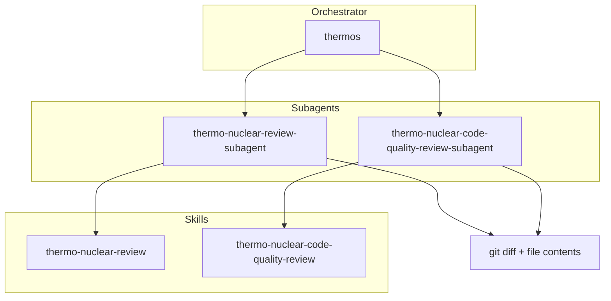

# Thermos plugin

Thermo-nuclear branch review for Cursor agents: deep correctness and security audits, harsh maintainability rubrics, and parallel subagent orchestration.

## Installation

```bash
/add-plugin thermos
```

## Architecture



## Skills

| Skill | Description |
|:------|:------------|
| `thermo-nuclear-review` | Deep branch audit (bugs, breakages, security, devex, feature-gate leaks). |
| `thermo-nuclear-code-quality-review` | Strict maintainability audit (code-judo, 1k-line rule, spaghetti, boundaries). |
| `thermos` | Run both review subagents in parallel and synthesize findings. |

## Agents

| Agent | Description |
|:------|:------------|
| `thermo-nuclear-review-subagent` | Task subagent for deep review rubric (diff-scoped). |
| `thermo-nuclear-code-quality-review-subagent` | Task subagent for code-quality rubric (diff-scoped). |

## Typical usage

**Double review (thermos):**

1. Gather `git diff main...HEAD` and full contents of changed files.
2. Invoke both subagents in one message with `run_in_background: true`.
3. Synthesize prioritized, deduped findings.

**Single skill:** invoke `thermo-nuclear-review` or `thermo-nuclear-code-quality-review` in the main agent, or the matching subagent after gathering diff context.

## Migration from cursor-team-kit

`cursor-team-kit` previously included only `thermo-nuclear-code-quality-review`. That skill and agent now live in **Thermos** alongside deep review and `thermos`. Remove the old thermo entries from team-kit when you install this plugin to avoid duplicates.

## License

MIT
